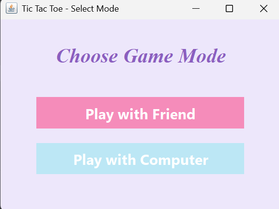

# Tic-Tac-Toe

A **pastel-themed Tic-Tac-Toe game** developed in **Java Swing**. This game supports both **two-player mode** (play with a friend) and **single-player mode** (play against the computer). It comes with a **scoreboard**, **undo move** (for two-player mode), and a **decorative UI** with pastel colors for an enhanced visual experience.

---

## Features

- **Two Game Modes**
    - **Play with Friend:** Local multiplayer mode where two players can play on the same screen.
    - **Play with Computer:** Single-player mode with a basic AI opponent that blocks moves and tries to win.

- **Scoreboard**
    - Tracks the number of wins for X, O, and draws.

- **Undo Move**
    - Undo the last move in two-player mode only.

- **Pastel-Themed UI**
    - Soft pastel colors for board and buttons.
    - Hover effects for buttons.
    - Decorative fonts for a pleasant user experience.

- **Computer Logic**
    - Blocks player moves and attempts winning combinations.
    - Plays strategically based on empty corners and center priority.

---

### Screenshots

### Mode Selection Screen


### Game Board

---

## How to Run

```bash
# Clone the repository
git clone https://github.com/Jenni006/Tic-Tac-Toe.git
cd Tic-Tac-Toe

# Compile all Java files
javac TicTacToe.java ModeSelectionScreen.java

# Run the application
java TicTacToe
